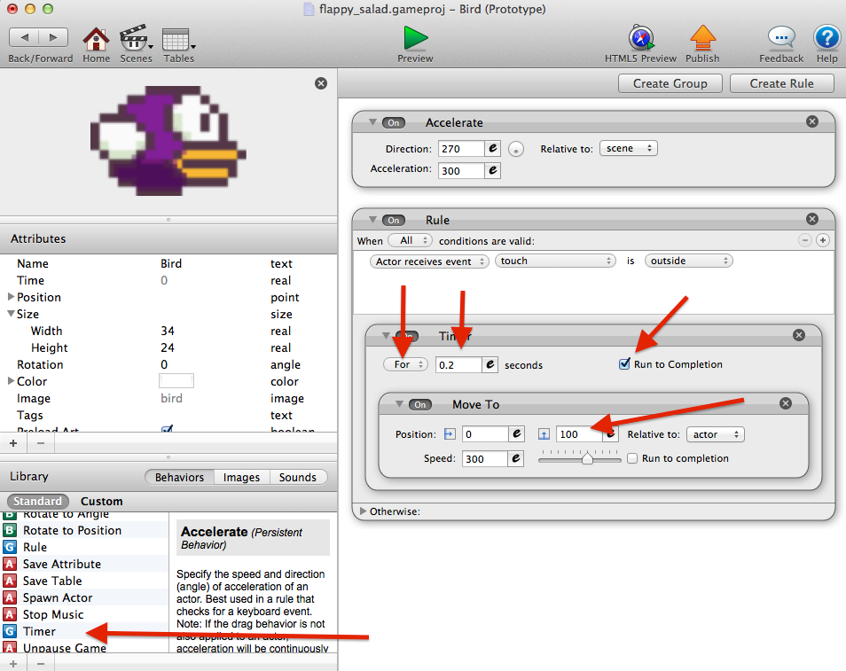

# Flappy Salad
How to make Flappy Bird in Game Salad

## Start Here:

### Download this repository
Download [here](https://github.com/patmood/flappy-salad/archive/master.zip). This repo has all the instructions and graphic assets you will need.

### Download Game Salad
Create an account with Game Salad and download the editor here: http://gamesalad.com/download

### Create a new project
Change the platform from iPhone to `Game Salad Arcade` and choose a name/description

## Scenes
Game scenes are used to organize your project into separate parts. You might have a menu scene, a game screen, or a separate screen for each level. In this game we can use 1 scene.

## Actors
Actors are objects in your game that contain unique behavior. This makes it easy to reuse the same work over and over again so we dont repeat ourselves. An actor could be the player, an enemy, an obstacle, or even just a background.

### Add an actor

In the actors section, click the `+` button to add a new actor that we can use for the background. Double click the new actor to edit and drag the background in to the Game Salad editor.

### Add the backgroung actor to the scene
Drag the new actor with the background image on to the game screen and resize it to fill the screen.

Notice how the image is stretched. Open the actor again and Under the attributes, Change Graphics > Horizontal Wrap to `tile` so that it repeats over and over in the horizontal direction. Much better.

### The Bird
Create a new actor to control the player and add the bird image, just like the background.

This time we need to set the actor image attributes so the image isnt stretched. Change `width` to 32 and `height` to 24.

Go back to the scene and drag the bird on to the game screen.

Now it's starting to look like a real game!

## Creating Behavior

We can use a series of rules and conditions to add logic to the game. This is what controls all the movement and events in the game.

To start, open the bird actor and drag the `Accelerate` behavior to the blank pane on the right. Change Direction to `270`, Acceleration `300`, Relative to `scene`.

If 0 is right, 90 degrees is up, and 270 is down. Acceleration controls how fast the bird will fall, and the movement is relative to the whole scene.

Now if you preview the game, the bird should fall to the ground!

### Flapping the bird

Still on the bird actor screen, create a new rule - `touch` is `outside`. This means when a touch or click is detected "outside" the bird, this action will happen.

From the list of behaviors, drag a `Timer` into the rule. This means that the timer will run every time the screen is `touched` `outside` of the bird. Make the timer for `0.2` seconds and tick the `run to completion` box.

Now drag a `Move To` behavior fromt he list to inside the timer. We want the bird to move `100` pixels in a Y direction (relative to the actor, itself)

