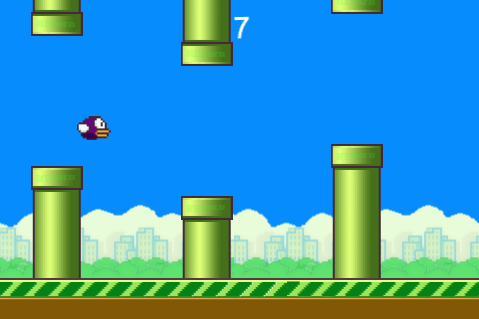

# Flappy Salad

How to make a Flappy Bird style game in GameSalad!

Notes for my middle school class about making games.

## Start Here

- [Part 1 - Setup](part1.md)
- [Part 2 - Adding a player](part2.md)
- [Part 3 - Life and death](part3.md)
- [Part 4 - Scoring](part4.md)
- [Part 5 - Finishing Touches](part5.md)

## Free Resources and tools for your own game

### Graphics

- [Pixen for mac](https://mega.co.nz/#!VkAGnR5S!YYViDiyh1gWrKgAo5XSM4-Xo2ItLhQYfBMvTdba3s0w) - Retro 8bit pixel style graphics
- [Pixlr](http://apps.pixlr.com/editor/) - Photoshop style editor online
- [OpenGameArt](http://opengameart.org/) - Forum with free sprites and graphics
- Search for free sprites in the style you are looking for

### Sound

 - [Bfxr](http://www.bfxr.net/) - Custom sound effects
 - [Audacity](http://audacity.sourceforge.net/) - Mac/Windows software to record and edit sounds. Good for speeding up, slowing down, recording, and trimming audio files.

### GameSalad

- [Cookbook](https://help.gamesalad.com/hc/en-us/categories/200134158-Cookbook-Tutorials) - Tutorials on how to use all GameSalad features.
- [Forums](http://forums.gamesalad.com/) - Search or post issues that you're having and find solutions.
