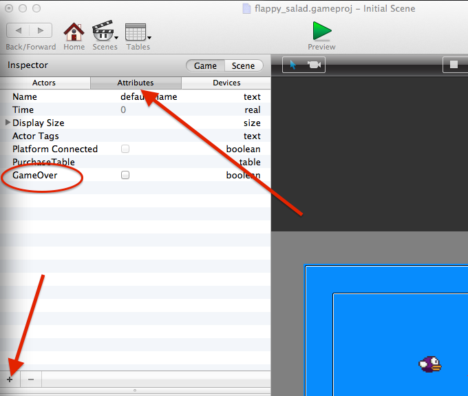
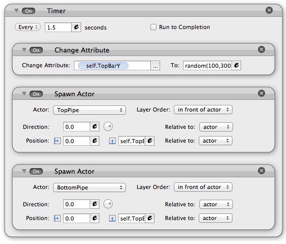

# Part 3 - Life and death

There needs to be a way to tell if the player is alive, or if the game is over. For this we'll use a game attribute called `GameOver`. On the scene screen, switch from actors to attributes, then add a new "boolean" and name it `GameOver`.

Now edit the bird actor and create a new rule: When `Attribute` `game.GameOver` is `false` and drag all the other rules into it. This means that all the behavior we've made so far will run when the game is not over.

The bird actor should look something like this:

### Hitting the ground

Create a new actor and drag the ground.png image onto it. Edit the `Graphics` attribute so that `Horizontal Wrap` is `tile`. Now you can stretch the ground so it is wide enough to cover the full width of the screen.

The game is over when the bird hits the ground, so make a new rule in the bird actor that changes the games GameOver attribute to `true` and sets the actor velocity to 0, like this:

### Pipes

Now for the fun part! Create 2 new actors called `top pipe` and `bottom pipe`. Drag the image on to the `top pipe` in the scene view. Doing this in the scene view will resize the actor to match the image.

We can use the same image for the bottom pipe, but flip it. Open the bottom pipe actor, and drag the pipe image from the library. You'll need to switch from behaviors to images in the library.

When the image is set, open the Graphics attribute and tick the `Flip Vertically` box.

We also need to change the `Size` attribute to be 52 wide and 320 high so the image doesnt stretch.

Open the top pipe actor and add a behavior to give it a Velocity of `50` in direction `180`. You can copy this behavior by pressing `cmd + C` and pasting it into the bottom pipe

### Spawn pipes

Add a new actor called `pipe spawner`. This actor wont appear in our game, but it will contain the logic that creates random pipes.

Add an new attribute to the `pipe spawner` called `TopBarY` which is an integer. This will be used to store the Y position of the pipes.

Open the `pipe spawner` and add a timer from the behaviors library. Set this to run every 5 seconds. We want new pipes to be spawned every time the timer runs, so drag the `Spawn Actor` behavior into the timer.

Choose the `top pipe` actor to spawn and for position, set Y to `self.TopBarY` which you can find from the drop down menu under pipe spawner (since the attribute is attached to the pipe).

Copy/paste this behavior for the bottom pipe, but set position Y to `self.TopBarY - 400`. This will put the bottom bar below the top bar.

Before we spawn the 2 pipes, we need to change TopBarY to be random each time. Drag the `Change Attribute` behavior into the timer and put it above the pipe spawner. Make it change `self.TopBarY` to random(100, 300). It should look like this in the end:

### Collide with pipes

Just like when the player touches the ground, we need to end the game when they hit one of hte pipes.

We can reuse the original rule (since it's the same behavior), but add conditions for when the bird touches the pipe. When `ANY` of these conditions is `true`, the `gameOver` attribute will be changed.

Now the game is starting to get challenging!

### Stop the pipes

There's one more problem. Even when the game is over, the pipes keep moving. Lets add a condition that only moves the pipes while the game is running.

Remember to make the same change to both pipes.

