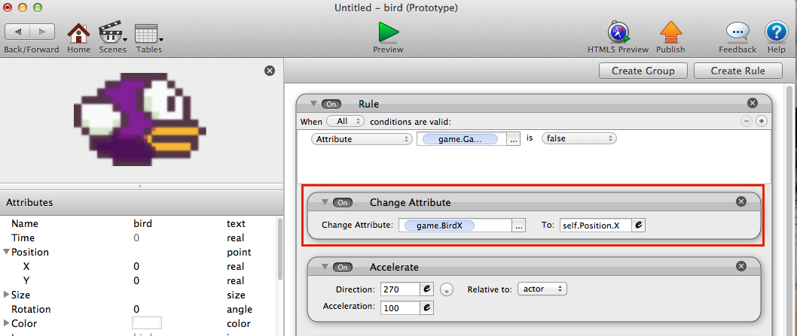

# Part 4 - Scoring

### Show the Score

Go back to the scene overview screen and make 2 new attributes.
  - One called `Score`. This will be an integer that will store how many pipes we pass.
  - Another called `BirdX`, an integer to hold the x position of the bird

Create a new actor called `Score`. Open it up and add a behavior called `Display Text`. Set this to display the `game.Score` attribute and position it relative to the scene. It might take some tweaking to get it where you like.

In the `Bird` actor, add a new `Change Attribute` behavior that sets the global `BirdX` attribute you created. This is a behavior that will happen any time the game is running, just like accelleration. Here is an example:

### Update the score

In our flappy salad game, the player will score every time they get through a pipe.

In game programming terms, we can say this is the equivalent of the `Top Pipe` actor's X position being less than the `Bird` X position.

Capture this behavior in the `Top Pipe` actor:

### What's your high score?

Now you have a way of keeping track of the score! What's your best?

Try changing the difficulty by modifying the speed of the pipes, distance between pipes, hight of the birds flapping, and anything else you can think of!
