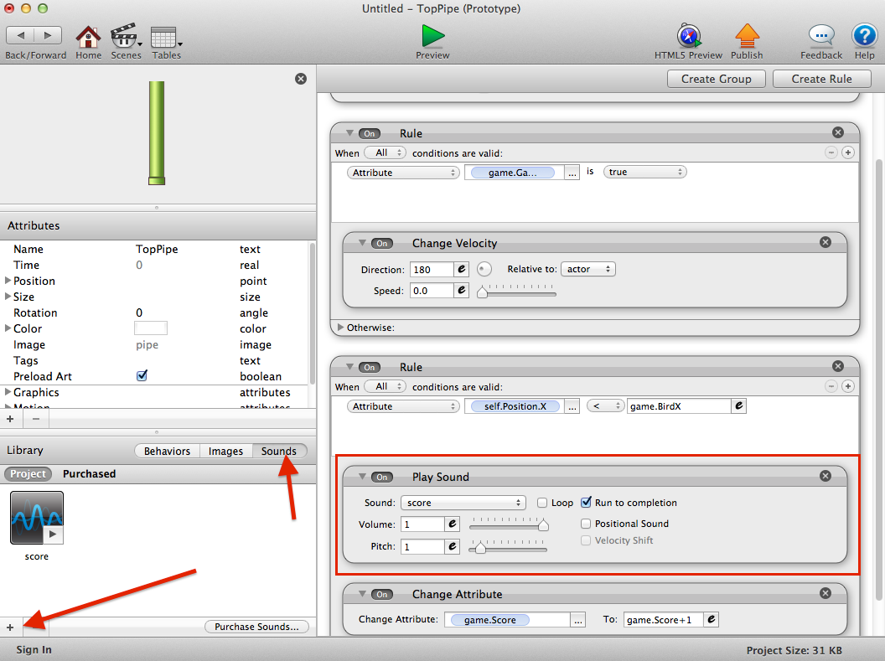
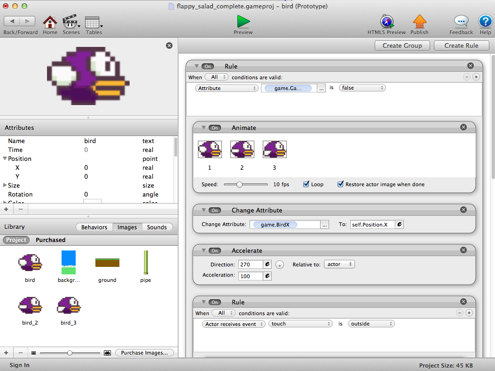

# Part 5 - Finishing Touches

### Adding sound

The original flappy bird game has sounds for flapping, scoring, and game over.

Once we add these assets (in the assets folder as `ouch.wav`, `score.wav`, and `flap.wav`) then we can use the "Play Sound" behavior to play them at the right times.

Here is an example of where we would play the score sound:

Add the `ouch` and `flap` sounds to the Bird actor in the correct location.

### Animation

There's still something missing...

Our bird still doesnt flap! It's not a very flappy bird without the wing animation!

While the player is alive, add an 'Animate' behavior and drag in the 3 images for the bird. Each image is a different animation frame for the flap.

Now we have a truly flappy bird!
